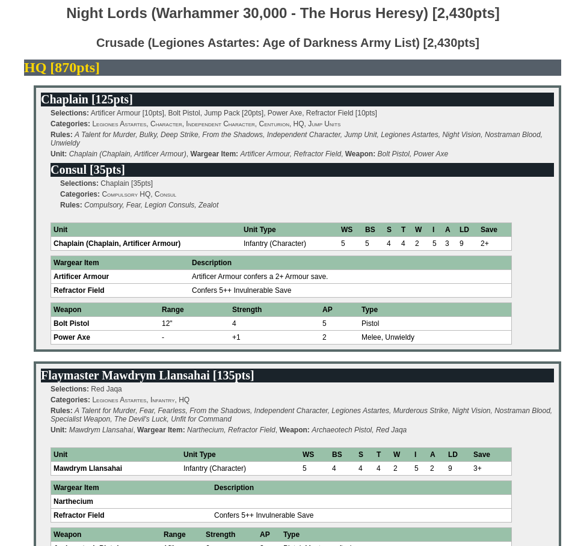
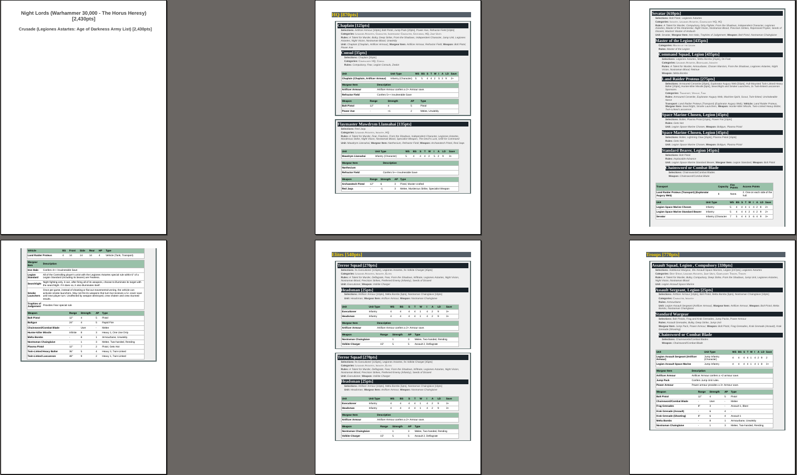

# Table of Contents
1. [Introduction](#Introduction)
2. [Usage](#Usage)
3. [Examples](#Examples)

# Introduction
BattleScribe CSS Template for Horus Heresy

This file is based off the CSS output of the BattleScribe program and is intended to replace its style definitions for Horus Heresy army roster exports in HTML format which results in a better readable and printable output.

The colour scheme is a bit oriented towards the Warhammer 40k 8th edition unit sheets.

## Usage

1. Create a HTML roster export with BattleScribe
2. Place the file bscribe-style.css in the same directory
3. Edit the HTML file in a text editor of choice (notepad, notepad++, etc)
4. Delete the `<style> ... </style>` section (multiple lines) at the top of the HTML file and replace it with the following line:
```
<link rel="stylesheet" href="bscribe-style.css">
```
5. Load the HTML file in your browser and optionally print out the file

## Examples
### Browser View
The first example shows how a roster looks in the web browser.


### PDF View
The second example is an overview of the first couple of pages after printing the example roster from above, scaled down to show the general layout and page breaks.

